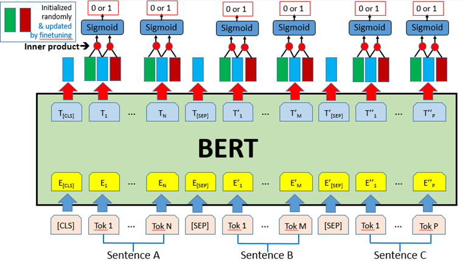
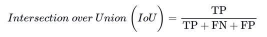

# A Chinese-Based Long Text Extractive Summarization System Based on the BERT Model

## About
This is a graduate project in CSIE at NTPU, led by two students majoring in STAT. Our focus is on leveraging BERT to summarize social workers' records, with the aim of enhancing their work efficiency.

## Abstract
The rapid development of AI significantly impacts our lives, and natural language processing (NLP) stands out as a rapidly evolving field. However in the realm of Chinese-based NLP, the developments differ significantly from English NLP. 

We have designed a BERT-based relevance scoring mechanism inspired by cogLTX to identify valuable sentences. Then, employing techniques such as sentence embedding, we feed the output into another BERT model (the reasoner) to summarize the paragraph within the domain of social work.

## Proposed Framework
1. Data preprocessing
2. Semantic scoring model (Judge)
3. Judge model training
4. Generate compressed document
5. Semantic summarization model (Reasoner)
6. Reasoner model training
7. Construction of training data
8. Evaluation methods
9.  Model comparison
10. Actual deployment
11. Joint training

<!--  -->

> Implementation details to be filled out ...

## Experiment
pass

## Conclusion and Expected Outcomes
In the field of text summarization, we've observed a lack of mature Chinese-based long text models. In our project, we introduce a workflow specifically designed to handle Chinese long texts. We aim to uncover the underlying relevance between sentences and ultimately extract valuable information from paragraphs within the domain of social work. We hope that our project's contribution will offer social workers an efficient way of familiarizing themselves with their clients' cases.

> This project was uploaded to GitHub on April 14, 2024.